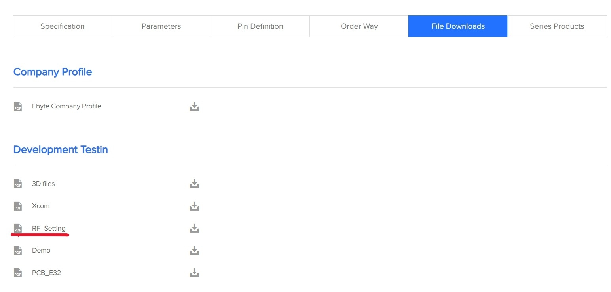
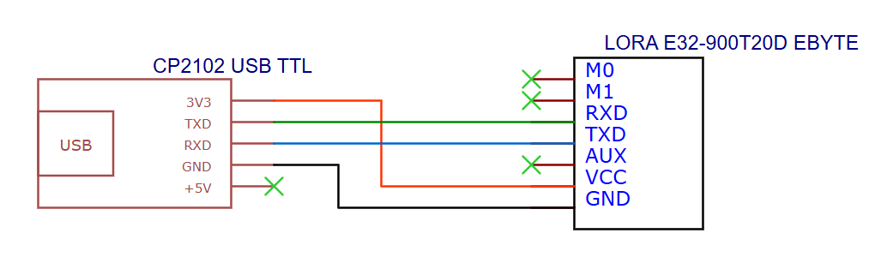
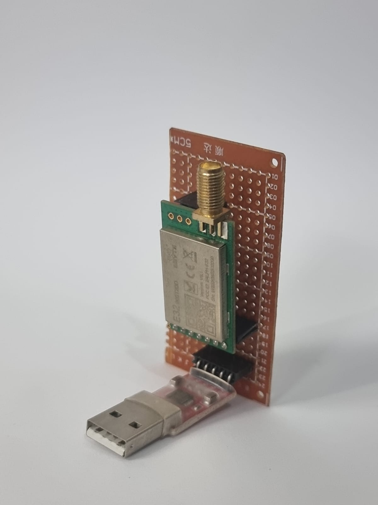
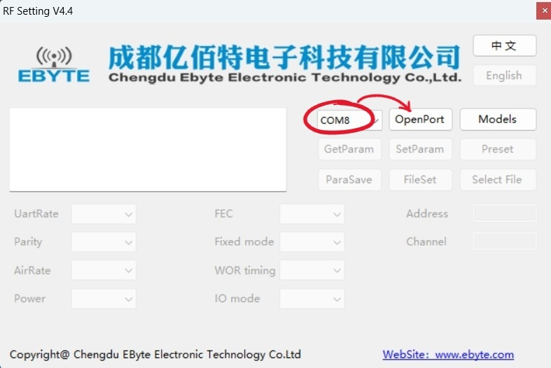
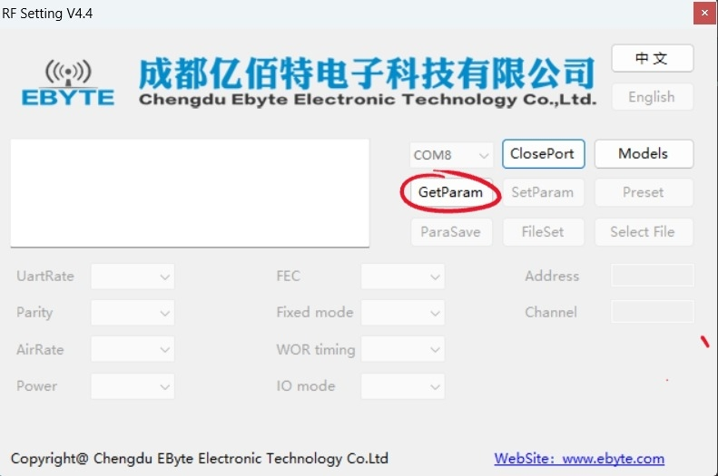
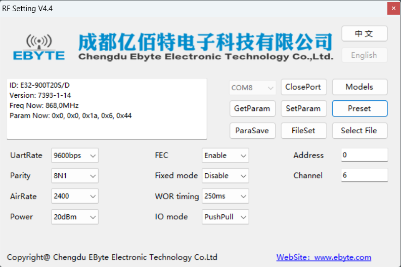
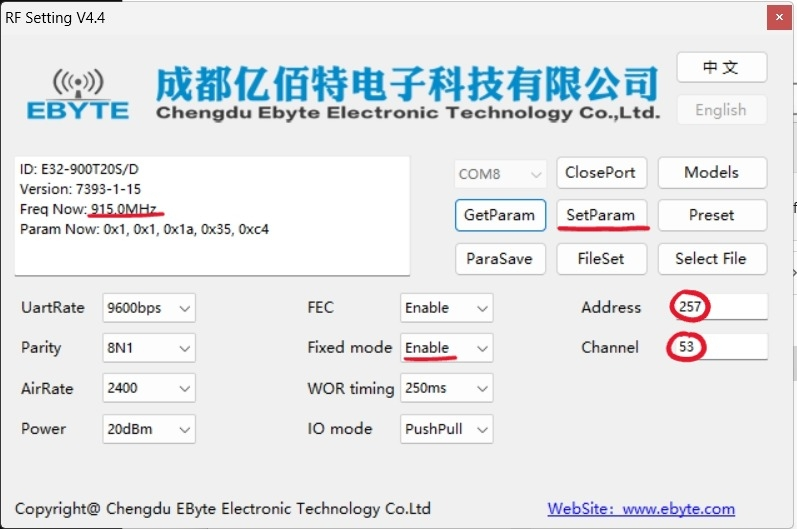

# Configuração LoRa 900T20D
## Passo a passo da configuração do rádio LoRa 900T20D

O primeiro passo, antes mesmo de desenvolver o hardware e software do protótipo, deu-se por iniciar a configuração para conectividade dos rádios LoRa ponto a ponto. Para tal, utilizou-se os seguintes materiais adquiridos:

- Lora E32 900T20D
- Antena TX915-JDK-20
- Conversor CP2102

### Passo a passo da configuração do rádio LoRa 900T20D
Utilizando como referência o manual da Univates e o trabalho de conclusão de Pedo (2020), segue o passo a passo detalhado de configuração do LoRa 900T20D:

1. Acessar o site da CDEByte.
2. Na aba **File Downloads**:
   - Baixar o manual da Univates.
   - Baixar o software **RF Setting** (Figura 1).

   
   *Figura 1: Baixar programa RF Setting. Fonte: A autora.*

3. Conectar o CP2102 com o LoRa seguindo o esquema da Figura 2.

   
   *Figura 2: Esquemático LoRa e CP2102. Fonte: A autora.*

   Nesta etapa, foi criado um pequeno módulo inspirado em uma protoshield com um fragmento de placa perfurada (Figura 3), a fim de eliminar ruídos causados por protoboard e otimizar as conexões.

   
   *Figura 3: Protoshield CP2102 e LoRa. Fonte: A autora.*

4. Abrir o programa **RF Setting**.
5. Selecionar a porta na qual o módulo CP2102 está conectado (Figura 4).

   
   *Figura 4: Selecionar porta no programa. Fonte: A autora.*

6. Clicar em **GetParam** para visualizar os parâmetros do módulo LoRa correspondente à porta selecionada (Figura 5).

   
   *Figura 5: Visualizar parâmetros do módulo. Fonte: A autora.*

   Ao clicar, a tela será atualizada, conforme indicado na Figura 6.

   
   *Figura 6: Tela de parâmetros do módulo. Fonte: A autora.*

7. Alterar os seguintes parâmetros:
   - **Address**: de 0 para 257.
   - **Channel**: de 6 (868MHz) para 53 (915MHz).
   - **Fixed mode**: de **Disable** para **Enable**.

8. Clicar em **SetParam** conforme indicado na Figura 7.

   
   *Figura 7: Tela de parâmetros do módulo em 915MHz. Fonte: A autora.*

A Figura 7 ilustra como a tela de configuração de ambos os módulos LoRa deve estar após finalizada a configuração.
