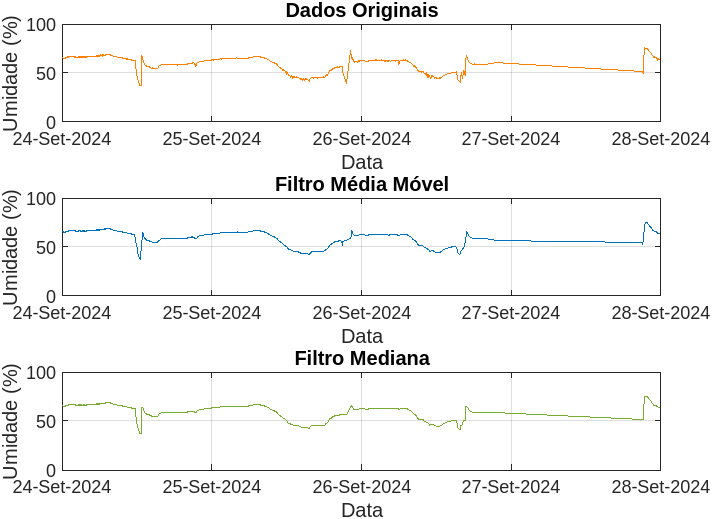
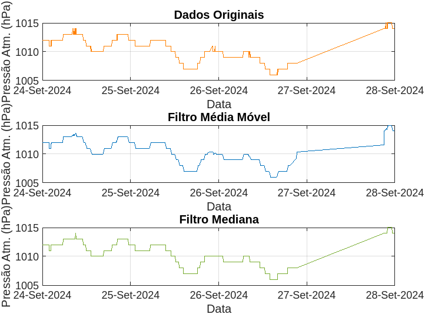
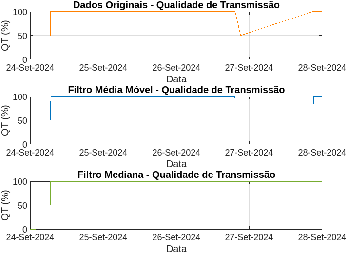
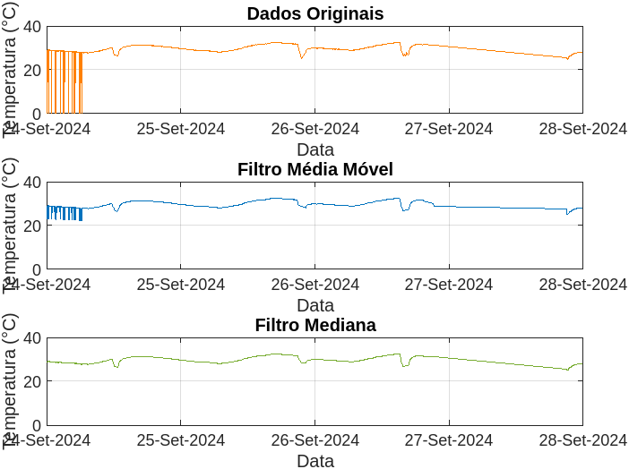
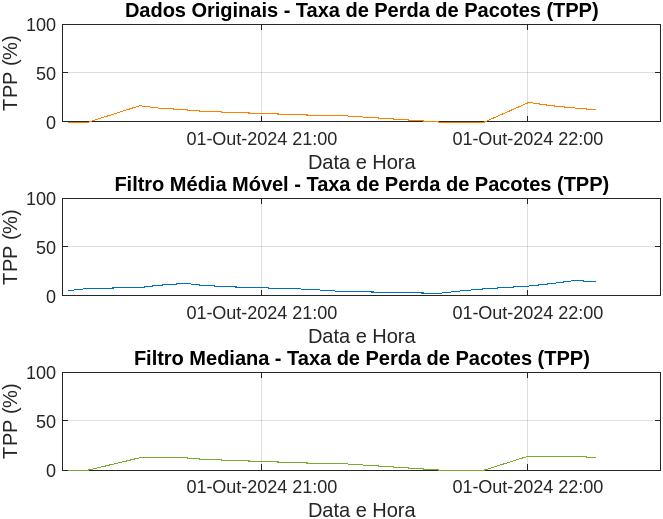

# Pasta MATLAB - Análise de Dados e Filtragem

Este diretório contém os códigos MATLAB utilizados para processar e filtrar dados de sensores de umidade, pressão atmosférica, qualidade de transmissão e temperatura, além da taxa de perda de pacotes. Os scripts MATLAB aplicam filtros de Média Móvel e Mediana, e geram gráficos para análise comparativa.

## Estrutura dos Arquivos

- **Códigos MATLAB (.m)**: Scripts que realizam a leitura dos dados, aplicam filtros e geram gráficos para análise.
- **Imagens dos Gráficos**: Exemplos de saída dos gráficos gerados pelos scripts MATLAB. Os gráficos estão organizados por variável e método de filtragem.

## Exemplos de Gráficos Gerados

### Umidade (%)
Os gráficos mostram os dados originais de umidade e os resultados após a aplicação dos filtros de Média Móvel e Mediana.

### Pressão Atmosférica (hPa)
Os gráficos mostram os dados de pressão atmosférica antes e depois da aplicação dos filtros.

### Qualidade de Transmissão (QT %)
Os gráficos representam a qualidade da transmissão antes e depois da filtragem.

### Temperatura (°C)
Estes gráficos comparam os dados de temperatura brutos com os dados processados.

### Taxa de Perda de Pacotes (TPP %)
Os gráficos ilustram a taxa de perda de pacotes original e após a filtragem.

## Uso dos Códigos MATLAB

Cada script MATLAB realiza o seguinte:
1. **Leitura dos Dados**: Os dados de entrada são lidos a partir do arquivo SIM.csv.
2. **Aplicação dos Filtros**: Filtros de Média Móvel e Mediana são aplicados no código.
3. **Geração dos Gráficos**: Gráficos são gerados para comparar os dados originais com os dados filtrados.

### Exemplo de Uso:
Para processar os dados de umidade e gerar gráficos com o filtro de Média Móvel e Mediana, execute o código `Umidade.m` para visualizar os testes realizados no ponto A, por exemplo.

## Observações
- Certifique-se de ter os arquivos de dados na mesma pasta dos scripts MATLAB.
- É recomendável utilizar MATLAB R2021a ou superior para garantir compatibilidade.

Para mais informações, consulte os scripts MATLAB disponíveis nesta pasta.
