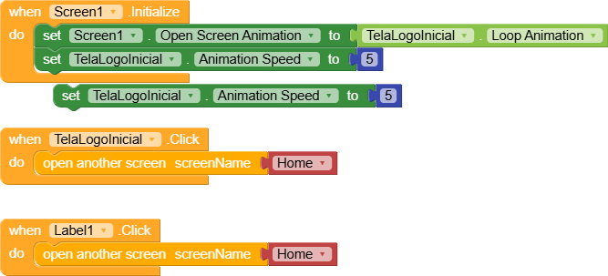

# Programação em Blocos do Aplicativo

Este diretório contém a programação em blocos do aplicativo desenvolvida utilizando a plataforma Kodular. Os blocos representam a lógica de navegação, controle de rede e outras funcionalidades do aplicativo. Cada bloco possui uma função específica e contribui para a funcionalidade geral do sistema.

## Estrutura dos Blocos

- **Navegação entre Telas**: Blocos que controlam a navegação entre diferentes telas do aplicativo.
- **Controle de Conectividade**: Blocos responsáveis por gerenciar conexões WiFi e resetar o sistema em caso de perda de conexão.
- **Notificações**: Blocos que exibem mensagens ao usuário para indicar ações necessárias, como conexão à rede WiFi.
- **Animações e Interações**: Blocos que configuram animações e interações para melhorar a experiência do usuário.

## Exemplos de Blocos

Abaixo estão alguns exemplos visuais dos blocos de programação utilizados:

### Navegação

### Controle de Conectividade
.png)

### Notificações
.png)

### Animações e Interações
.png)

... (e assim por diante para cada bloco relevante)

Cada imagem de bloco ilustra a programação necessária para implementar as funcionalidades mencionadas, garantindo que o aplicativo funcione conforme o esperado.
