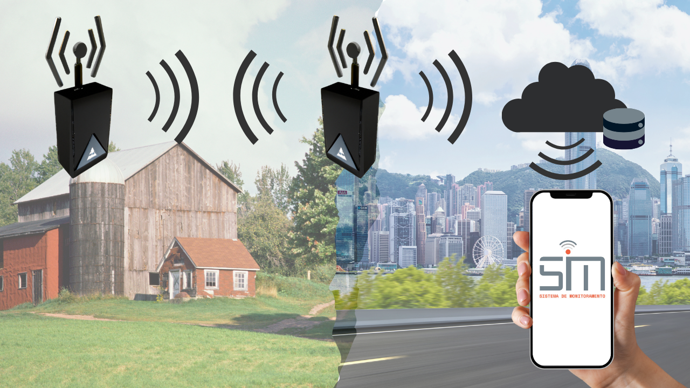
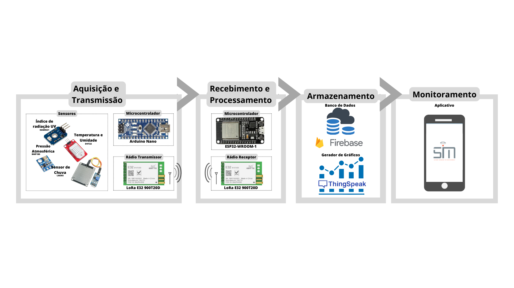
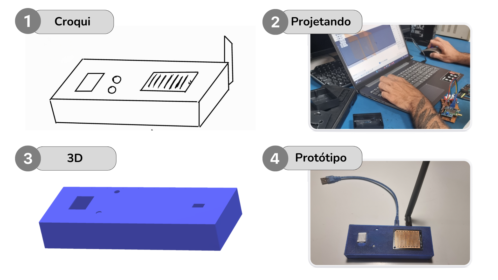
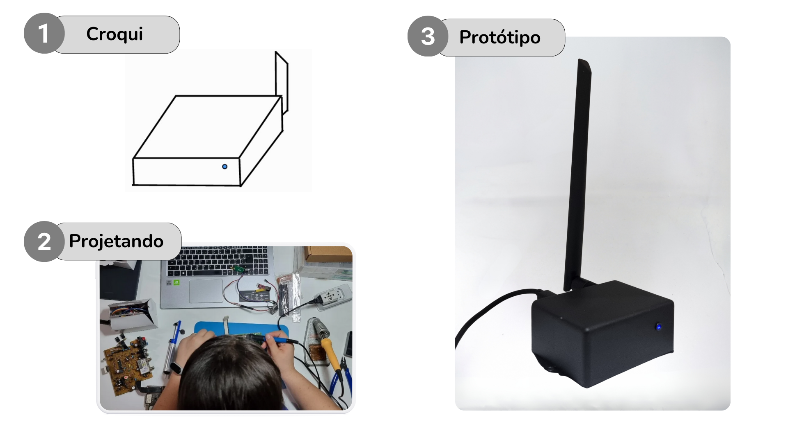

# Sistema para Aquisição e Monitoramento de Dados Utilizando Tecnologia LoRa

.gif)

## Descrição do Projeto

Este projeto é um protótipo de monitoramento de variáveis ambientais utilizando a tecnologia LoRa para comunicação de longa distância. Ele foi desenvolvido com o objetivo de fornecer uma solução de baixo custo para monitoramento remoto em áreas como agricultura, controle ambiental e estações meteorológicas.

O sistema utiliza microcontroladores ESP32 e Arduino Nano para coletar dados de diversos sensores (temperatura, umidade, pressão, entre outros) e transmitir essas informações. Os dados são armazenados em um banco de dados no Firebase e podem ser acessados em tempo real através de um aplicativo de monitoramento. Além disso, o sistema possui integração com a plataforma ThingSpeak para visualização gráfica dos dados.

Este repositório contém os códigos-fonte do projeto, bem como tutoriais detalhados para a conexão dos componentes, configuração do LoRa e aplicativo de monitoramento.

## Funcionalidades

- **Monitoramento em Tempo Real**: O sistema coleta e transmite dados de variáveis ambientais em tempo real para uma central de monitoramento.
- **Tecnologia LoRa**: Comunicação de longa distância utilizando o protocolo LoRa, ideal para áreas rurais ou remotas.
- **Aplicativo Móvel**: Monitoramento dos dados via aplicativo, com possibilidade de notificações em tempo real para condições críticas.
- **Integração com Firebase**: Armazenamento de dados no Firebase para visualização e análise.
- **Visualização no ThingSpeak**: Visualização gráfica dos dados coletados através da plataforma ThingSpeak.
  
## Tecnologias Utilizadas

- **LoRa E32**
- **ESP32**
- **Arduino Nano**
- **Firebase**
- **ThingSpeak**
- **Wi-Fi**
- **C++ (Arduino IDE)**
- **Aplicativo Android desenvolvido em Kodular**

## Desenvolvimento 

### Transmissor
O transmissor coleta dados dos sensores e os envia via LoRa para o receptor.

### Receptor
O receptor recebe os dados do transmissor e os encaminha para o Firebase e o ThingSpeak.

